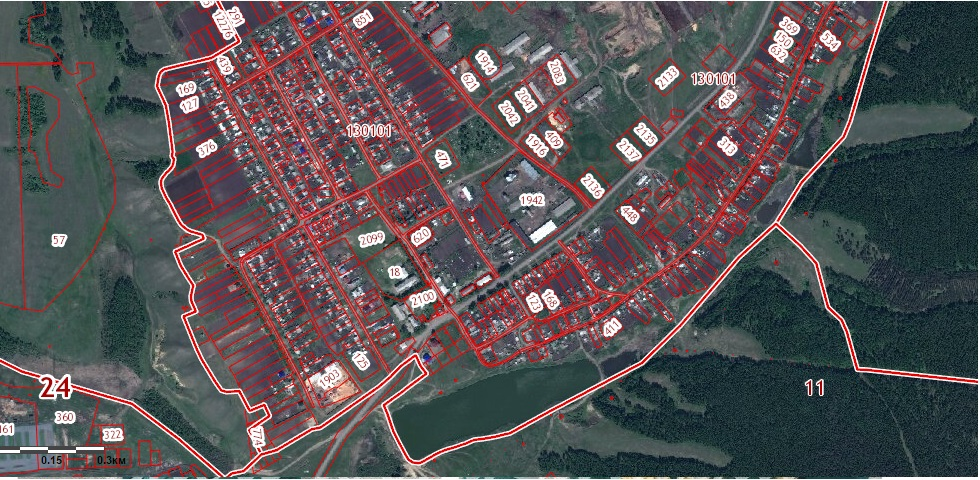

# Домашнее задание

# - обозначает заголовки текста

*Курсив* 

** - означает выделение текста курсивом

*  Элемент 1

* Элемент 2

* Элемент 3

*-обозначает элемент списка пишется через пробел

**Полужирный**

**** - означает полужирный

#выделение текста#

<rd1.gr@yandex.ru> автоматическое создание ссылок

Семинар урок 2 

Тема: введение в контроль

22222222

 333333 555555  666666

